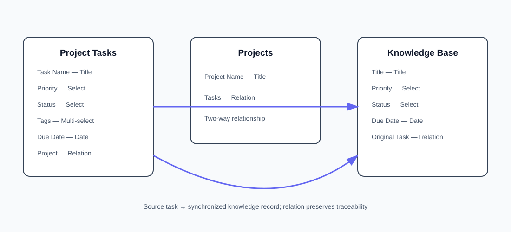

# ⚡ Notion Project Tasks → Knowledge Base Sync

> **Production-style Notion database automation built with n8n + Notion API**

[](https://n8n.io/)
[](https://developers.notion.com/)
[](#workflow-architecture)
[](SECURITY.md)
[](LICENSE)

Automated synchronization between a **Notion Project Tasks database** and a **Knowledge Base database**.

The automation detects task creation and updates, extracts structured task data, checks the target database using the source-task relation, and performs an **update-or-create (upsert)** operation while preserving traceability.


<p align="center">
  <a href="https://www.loom.com/share/307f15da00f34f7687b6beb9bf913f1b">
    
  </a>
  <a href="https://mohammad-shaheed.app.n8n.cloud/assistant/2a6a757f-6b4e-4c2a-9cfd-c3e2644e3a9d">
    
  </a>
  <a href="https://app.notion.com/developers/connections/3e07b079-dc53-814d-bcc9-0027985469ef?spaceId=6467b079-dc53-81ea-936c-0003c77a18fe">
    
  </a>
</p>

<p align="center">
  <a href="docs/diagrams/architecture.svg">
    
  </a>
  <a href="docs/assessment/assessment-mapping.md">
    
  </a>
  <a href="workflow/notion-project-tasks-to-knowledge-base-sync.json">
    
  </a>
  <a href="docs/evidence/evidence-index.md">
    
  </a>
</p>


---

## 🎯 Problem

Manual copying of task information into a knowledge base can create duplicate records, stale metadata, and broken traceability.

This project implements a relation-aware automation pipeline:

**Create / Update → Extract → Lookup → Decide → Update / Create → Preserve Relation**

---

## 🧩 Solution at a Glance

| Layer | Technology | Responsibility |
|---|---|---|
| Source | Notion — Project Tasks | System of record |
| Automation | n8n | Triggering, mapping, decision logic |
| API | Notion API | Workspace/database operations |
| Target | Notion — Knowledge Base | Synchronized records |
| Relationship | Notion Relation | Source-to-target traceability |

---

## 🏗️ Workflow Architecture


```text
                    ┌──────────────────────┐
                    │     PROJECT TASKS    │
                    └──────────┬───────────┘
                               │
                    ┌──────────▼───────────┐
                    │ Task Created/Updated │
                    └──────────┬───────────┘
                               │
                    ┌──────────▼───────────┐
                    │  Extract Task Data   │
                    │ ID / Name / Priority │
                    │ Status / Due Date    │
                    └──────────┬───────────┘
                               │
                    ┌──────────▼───────────┐
                    │  Find in Knowledge   │
                    │       Base           │
                    │ Original Task = ID   │
                    └──────────┬───────────┘
                               │
                    ┌──────────▼───────────┐
                    │   KB Page Exists?    │
                    └───────┬───────┬──────┘
                            │ YES   │ NO
                            ▼       ▼
                       ┌────────┐ ┌────────┐
                       │ UPDATE │ │ CREATE │
                       └────┬───┘ └───┬────┘
                            │         │
                            └────┬────┘
                                 ▼
                    ┌──────────────────────┐
                    │    KNOWLEDGE BASE    │
                    │ + Original Task Link │
                    └──────────────────────┘
```

---

## 🔄 Workflow Components

| Node | Function |
|---|---|
| **Task Created** | Detects new records in Project Tasks |
| **Task Updated** | Detects updates to existing records |
| **Extract Task Data** | Normalizes ID, name, priority, status, due date |
| **Find in Knowledge Base** | Searches by source-task relation |
| **KB Page Exists?** | Controls the upsert branch |
| **Update Knowledge Base Page** | Refreshes an existing target page |
| **Create Knowledge Base Page** | Creates a missing target page |

### Relation-aware matching

The workflow uses the source **task ID** inside the **Original Task** relation instead of relying only on a visible title.

That makes repeated task updates resolve to the corresponding target page rather than generating another record for the same source task.

---

## 🗃️ Data Model



### Project Tasks

| Property | Type | Purpose |
|---|---|---|
| Task Name | Title | Primary task title |
| Priority | Select | Priority value |
| Status | Select | Workflow state |
| Tags | Multi-select | Categorization |
| Due Date | Date | Deadline |
| Project | Relation | Project relationship |

### Projects

| Property | Type | Purpose |
|---|---|---|
| Project Name | Title | Parent project |
| Tasks | Relation | Related task records |

### Knowledge Base

| Property | Type | Purpose |
|---|---|---|
| Title | Title | Synchronized record title |
| Priority | Select | Mirrored priority |
| Status | Select | Mirrored status |
| Due Date | Date | Mirrored deadline |
| Original Task | Relation | Backlink to source task |

---

## 🔐 Authentication & Security

The workflow uses a **Notion Internal Integration** through an n8n Notion credential.

Example verification request:

```http
GET /v1/users/me
Authorization: Bearer <NOTION_INTEGRATION_TOKEN>
Notion-Version: 2022-06-28
```

Real credentials are intentionally excluded from source control.

→ [Security guidance](SECURITY.md)

→ [Authentication example](examples/api/users-me-request.md)

---

## 🧠 Property Mapping

```text
Project Tasks
    │
    ├── id ───────────────► Original Task
    ├── Task Name ────────► Title
    ├── Priority ─────────► Priority
    ├── Status ───────────► Status
    └── Due Date ─────────► Due Date
```

The n8n export contains the corresponding property mappings and relation value expressions.

---

## ♻️ Upsert Strategy

```text
          Source Task
              │
              ▼
      Normalize task fields
              │
              ▼
     Search Knowledge Base
       by Original Task
              │
         ┌────┴────┐
         │         │
       FOUND     NOT FOUND
         │         │
         ▼         ▼
      UPDATE     CREATE
         │         │
         └────┬────┘
              ▼
     Preserve source relation
```

The lookup-before-create pattern is the workflow's main duplicate-prevention mechanism.

---

## 🧪 Assessment Coverage

This repository is organized around the supplied **Notion Integration (Knowledge Base & Database Automation)** assessment.

| Requirement | Artifact |
|---|---|
| Internal Integration | Authentication documentation |
| Database schema | Data model diagram + documentation |
| Page creation | API example + workflow |
| Property mapping | Mapping section + n8n export |
| Database query | Query example |
| Relation mapping | Data model + workflow |
| Content synchronization | n8n workflow export |
| End-to-end execution | Evidence index |
| Troubleshooting | Troubleshooting runbook |
| Mini project | Complete synchronization workflow |

→ [Detailed assessment matrix](docs/assessment/assessment-mapping.md)

---

## 📦 Repository Structure

```text
notion-project-tasks-sync/
│
├── README.md
├── LICENSE
├── SECURITY.md
├── .gitignore
│
├── workflow/
│   └── notion-project-tasks-to-knowledge-base-sync.json
│
├── docs/
│   ├── assessment/
│   │   ├── assessment-mapping.md
│   │   └── documentation-package.md
│   ├── diagrams/
│   │   ├── architecture.svg
│   │   └── data-model.svg
│   ├── evidence/
│   │   └── evidence-index.md
│   └── troubleshooting.md
│
└── examples/
    ├── api/
    │   ├── users-me-request.md
    │   ├── database-query-request.json
    │   └── page-create-request.json
    └── payloads/
        ├── task-input.json
        └── knowledge-base-output.json
```

---

## 🎥 Demonstration

Use the buttons at the top of this README to open the live demo, n8n workflow, and Notion integration directly.

---

## 📸 Evidence

The repository includes an evidence index mapping the captured n8n and Notion screenshots to the workflow components they demonstrate.

→ [Open Evidence Index](docs/evidence/evidence-index.md)

---

## 🛠️ Troubleshooting

Covered operational scenarios include:

**401 Unauthorized** · **403/404 access issues** · **database sharing** · **block append failures** · **property mapping** · **relation errors** · **429 rate limiting** · **empty query results**

→ [Troubleshooting Runbook](docs/troubleshooting.md)

---

## 🚀 Import & Run

1. Import `workflow/notion-project-tasks-to-knowledge-base-sync.json` into n8n.
2. Configure your own Notion credential.
3. Share the required Notion databases with the Internal Integration.
4. Verify the database/data-source IDs.
5. Create or update a task in Project Tasks.
6. Confirm the matching record is created or updated in Knowledge Base.

---

## 📚 Documentation

- [Assessment Matrix](docs/assessment/assessment-mapping.md)
- [Documentation Package](docs/assessment/documentation-package.md)
- [API Examples](examples/api/)
- [Sample Payloads](examples/payloads/)
- [Evidence Index](docs/evidence/evidence-index.md)
- [Troubleshooting](docs/troubleshooting.md)
- [Security](SECURITY.md)

---

## 👤 Author

### Shaik Mohammad Shaheed

**AI & Automation | n8n | Notion API | Workflow Automation | Generative AI**

GitHub: https://github.com/shaikshahid777

---

<p align="center">
  <strong>Notion + n8n • Relation-aware synchronization • API integration • Workflow automation</strong>
</p>
