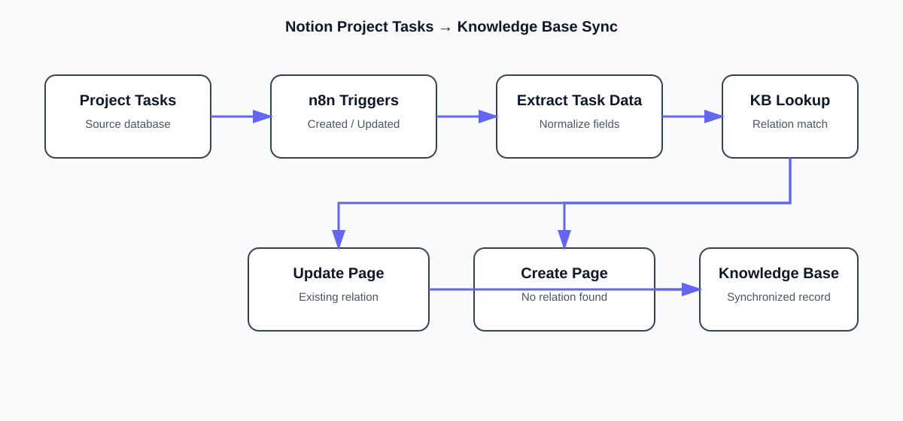

# Notion Project Tasks → Knowledge Base Sync

Automated cross-database synchronization workflow built with **n8n + Notion API**.



## Overview

This project synchronizes records from a **Project Tasks** Notion database into a **Knowledge Base** database whenever a task is created or updated.

The workflow:

1. Detects task creation/update events.
2. Extracts Task Name, Priority, Status, and Due Date.
3. Searches Knowledge Base by the **Original Task** relation.
4. Updates the existing KB page when a match exists.
5. Creates a new KB page when no match exists.
6. Preserves the relation to the source task.

This repository contains the exported workflow, assessment documentation, evidence screenshots, API examples, diagrams, and implementation notes.

> **Security:** No Notion integration token, password, webhook secret, or other credential is stored in this repository.

## Architecture

```text
Notion: Project Tasks
        │
        ├── Task Created
        └── Task Updated
                │
                ▼
        Extract Task Data
                │
                ▼
      Find in Knowledge Base
                │
                ▼
          KB Page Exists?
             /       \
          YES         NO
           │           │
           ▼           ▼
        Update       Create
           \          /
            ▼        ▼
        Knowledge Base
        + Original Task relation
```

## Databases

| Database | Purpose |
|---|---|
| Project Tasks | Source task records |
| Projects | Project/task relationship model |
| Knowledge Base | Synchronized secondary records |

### Project Tasks

- Task Name — Title
- Priority — Select
- Status — Select
- Tags — Multi-select
- Due Date — Date
- Project — Relation

### Projects

- Project Name — Title
- Tasks — Relation

### Knowledge Base

- Title — Title
- Priority — Select
- Status — Select
- Due Date — Date
- Original Task — Relation

## Workflow Logic

The workflow uses a relation-based existence check rather than task names. This makes the sync idempotent and avoids duplicate Knowledge Base records during repeated updates.

The exported workflow contains two Notion polling triggers, extraction/mapping logic, a Knowledge Base lookup, an IF decision, and separate create/update branches.

## Assessment Coverage

This implementation addresses the assessment areas for:

- Internal Integration authentication
- Shared Notion databases
- Database page creation
- Structured property mapping
- Database query filtering
- Relation property mapping
- Automated synchronization
- Upsert behavior
- End-to-end execution evidence
- Troubleshooting documentation

## Repository Structure

```text
.
├── README.md
├── LICENSE
├── .gitignore
├── docs/
│   ├── assessment/
│   │   ├── documentation-package.pdf
│   │   └── assessment-mapping.md
│   ├── diagrams/
│   │   ├── architecture.svg
│   │   └── data-model.svg
│   ├── evidence/
│   │   ├── 01-extract-task-data.png
│   │   ├── 02-find-knowledge-base.png
│   │   ├── 03-kb-page-exists.png
│   │   ├── 04-update-knowledge-base-page.png
│   │   ├── 05-create-knowledge-base-page.png
│   │   ├── 06-task-created-trigger.png
│   │   ├── 07-task-updated-trigger.png
│   │   ├── 08-knowledge-base.png
│   │   └── 09-project-tasks.png
│   └── troubleshooting.md
├── examples/
│   ├── api/
│   │   ├── users-me-request.md
│   │   ├── database-query-request.json
│   │   └── page-create-request.json
│   └── payloads/
│       ├── task-input.json
│       └── knowledge-base-output.json
└── workflow/
    └── notion-project-tasks-to-knowledge-base-sync.json
```

## Demo

Loom: https://www.loom.com/share/307f15da00f34f7687b6beb9bf913f1b

## Notion

Project Tasks / Knowledge Base workspace evidence is documented in `docs/evidence/`.

## Implementation Notes

The assessment asks for structured block content, compound queries, relations, and synchronization. The provided n8n export specifically implements the automated create/update synchronization path and relation-preserving upsert logic. The accompanying assessment mapping distinguishes implemented workflow behavior from documented assessment concepts.

## Author

**Shaik Mohammad Shaheed**

AI & Automation • n8n • Notion API • Workflow Automation
